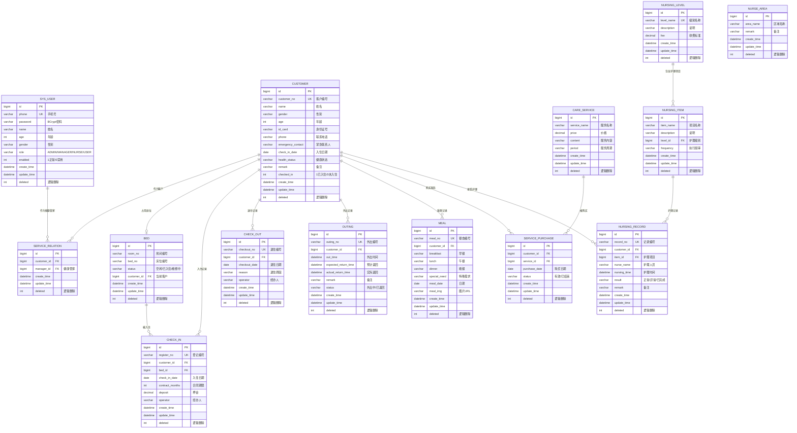

# 东软颐养中心管理系统 ER 图

## 实体关系说明

| 关系 | 说明 |
|------|------|
| CUSTOMER → BED | 一个客户占用一个床位（退住后释放） |
| CUSTOMER → CHECK_IN | 一个客户可有多次入住记录 |
| BED → CHECK_IN | 一个床位可被多次入住使用 |
| CUSTOMER → CHECK_OUT | 一个客户可有多次退住记录 |
| CUSTOMER → OUTING | 一个客户可有多次外出记录 |
| CUSTOMER → MEAL | 一个客户每天可有膳食记录 |
| CUSTOMER → SERVICE_PURCHASE | 一个客户可购买多个服务 |
| CARE_SERVICE → SERVICE_PURCHASE | 一个服务可被多人购买 |
| NURSING_LEVEL → NURSING_ITEM | 一个级别包含多个护理项目 |
| CUSTOMER → NURSING_RECORD | 一个客户可有多条护理记录 |
| NURSING_ITEM → NURSING_RECORD | 一个护理项目可有多条执行记录 |
| SYS_USER → SERVICE_RELATION | 健康管家与客户的服务关系 |
| CUSTOMER → SERVICE_RELATION | 客户与健康管家的服务关系 |
