# 东软颐养中心管理系统 — 架构图集

> 所有图表使用 Mermaid 语法，可在 VSCode（安装 Markdown Preview Mermaid 插件）、Typora、GitHub 等工具中渲染。

---

## 目录

1. [ER 图（实体关系图）](#1-er-图实体关系图)
2. [系统架构图](#2-系统架构图)
3. [后端模块依赖图](#3-后端模块依赖图)
4. [前端组件关系图](#4-前端组件关系图)
5. [登录时序图](#5-登录时序图)
6. [CRUD 操作时序图](#6-crud-操作时序图)
7. [入住登记时序图](#7-入住登记时序图)
8. [退住登记时序图](#8-退住登记时序图)
9. [入住流程图](#9-入住流程图)
10. [退住流程图](#10-退住流程图)
11. [外出登记流程图](#11-外出登记流程图)
12. [前端路由守卫流程图](#12-前端路由守卫流程图)
13. [JWT 认证流程图](#13-jwt-认证流程图)
14. [文件上传流程图](#14-文件上传流程图)
15. [前端通用 CRUD 渲染流程图](#15-前端通用-crud-渲染流程图)
16. [角色权限矩阵图](#16-角色权限矩阵图)

---

## 1. ER 图（实体关系图）

```mermaid
erDiagram
    SYS_USER ||--o{ SERVICE_RELATION : "作为健康管家"
    CUSTOMER ||--o{ SERVICE_RELATION : "作为客户"
    CUSTOMER ||--o| BED : "占用床位"
    CUSTOMER ||--o{ CHECK_IN : "入住记录"
    BED ||--o{ CHECK_IN : "被入住"
    CUSTOMER ||--o{ CHECK_OUT : "退住记录"
    CUSTOMER ||--o{ OUTING : "外出记录"
    CUSTOMER ||--o{ MEAL : "膳食记录"
    CUSTOMER ||--o{ SERVICE_PURCHASE : "购买服务"
    CARE_SERVICE ||--o{ SERVICE_PURCHASE : "被购买"
    NURSING_LEVEL ||--o{ NURSING_ITEM : "包含护理项目"
    CUSTOMER ||--o{ NURSING_RECORD : "接受护理"
    NURSING_ITEM ||--o{ NURSING_RECORD : "护理记录"

    SYS_USER {
        bigint id PK "自增主键"
        varchar phone UK "手机号（登录账号）"
        varchar password "BCrypt加密密码"
        varchar name "姓名"
        int age "年龄"
        varchar gender "性别"
        varchar role "角色: ADMIN/MANAGER/NURSE/USER"
        int enabled "启用状态: 1正常/0禁用"
        datetime create_time "创建时间"
        datetime update_time "更新时间"
        int deleted "逻辑删除: 0正常/1删除"
    }

    CUSTOMER {
        bigint id PK "自增主键"
        varchar customer_no UK "客户编号（自动生成）"
        varchar name "姓名"
        varchar gender "性别"
        int age "年龄"
        varchar id_card "身份证号"
        varchar phone "联系电话"
        varchar emergency_contact "紧急联系人"
        date check_in_date "入住日期"
        varchar health_status "健康状态"
        varchar remark "备注"
        int checked_in "是否入住: 1已入住/0未入住"
        datetime create_time "创建时间"
        datetime update_time "更新时间"
        int deleted "逻辑删除"
    }

    BED {
        bigint id PK "自增主键"
        varchar room_no "房间编号"
        varchar bed_no "床位编号"
        varchar status "状态: 空闲/已入住/维修中"
        bigint customer_id FK "当前入住客户ID"
        datetime create_time "创建时间"
        datetime update_time "更新时间"
        int deleted "逻辑删除"
    }

    CHECK_IN {
        bigint id PK "自增主键"
        varchar register_no UK "登记编号（自动生成）"
        bigint customer_id FK "客户ID"
        bigint bed_id FK "床位ID"
        date check_in_date "入住日期"
        int contract_months "合同期限（月）"
        decimal deposit "押金"
        varchar operator "经办人"
        datetime create_time "创建时间"
        datetime update_time "更新时间"
        int deleted "逻辑删除"
    }

    CHECK_OUT {
        bigint id PK "自增主键"
        varchar checkout_no UK "退住编号（自动生成）"
        bigint customer_id FK "客户ID"
        date checkout_date "退住日期"
        varchar reason "退住原因"
        varchar operator "经办人"
        datetime create_time "创建时间"
        datetime update_time "更新时间"
        int deleted "逻辑删除"
    }

    OUTING {
        bigint id PK "自增主键"
        varchar outing_no UK "外出编号（自动生成）"
        bigint customer_id FK "客户ID"
        datetime out_time "外出时间"
        datetime expected_return_time "预计返回时间"
        datetime actual_return_time "实际返回时间"
        varchar remark "备注"
        varchar status "状态: 外出中/已返回"
        datetime create_time "创建时间"
        datetime update_time "更新时间"
        int deleted "逻辑删除"
    }

    MEAL {
        bigint id PK "自增主键"
        varchar meal_no UK "餐食编号（自动生成）"
        bigint customer_id FK "客户ID"
        varchar breakfast "早餐"
        varchar lunch "午餐"
        varchar dinner "晚餐"
        varchar special_need "特殊需求"
        date meal_date "日期"
        varchar meal_img "膳食图片URL"
        datetime create_time "创建时间"
        datetime update_time "更新时间"
        int deleted "逻辑删除"
    }

    CARE_SERVICE {
        bigint id PK "自增主键"
        varchar service_name "服务名称"
        decimal price "价格"
        varchar content "服务内容"
        varchar period "服务周期"
        datetime create_time "创建时间"
        datetime update_time "更新时间"
        int deleted "逻辑删除"
    }

    SERVICE_RELATION {
        bigint id PK "自增主键"
        bigint customer_id FK "客户ID"
        bigint manager_id FK "健康管家ID（关联sys_user）"
        datetime create_time "创建时间"
        datetime update_time "更新时间"
        int deleted "逻辑删除"
    }

    SERVICE_PURCHASE {
        bigint id PK "自增主键"
        bigint customer_id FK "客户ID"
        bigint service_id FK "服务项目ID"
        date purchase_date "购买日期"
        varchar status "状态: 有效/已结束"
        datetime create_time "创建时间"
        datetime update_time "更新时间"
        int deleted "逻辑删除"
    }

    NURSING_LEVEL {
        bigint id PK "自增主键"
        varchar level_name UK "级别名称"
        varchar description "说明"
        decimal fee "收费标准"
        datetime create_time "创建时间"
        datetime update_time "更新时间"
        int deleted "逻辑删除"
    }

    NURSING_ITEM {
        bigint id PK "自增主键"
        varchar item_name "护理项目名称"
        varchar description "说明"
        bigint level_id FK "所属护理级别ID"
        varchar frequency "执行频率"
        datetime create_time "创建时间"
        datetime update_time "更新时间"
        int deleted "逻辑删除"
    }

    NURSING_RECORD {
        bigint id PK "自增主键"
        varchar record_no UK "记录编号（自动生成）"
        bigint customer_id FK "客户ID"
        bigint item_id FK "护理项目ID"
        varchar nurse_name "护理人员"
        datetime nursing_time "护理时间"
        varchar result "结果: 正常/异常/已完成"
        varchar remark "备注"
        datetime create_time "创建时间"
        datetime update_time "更新时间"
        int deleted "逻辑删除"
    }

    NURSE_AREA {
        bigint id PK "自增主键"
        varchar area_name "区域名称"
        varchar remark "备注"
        datetime create_time "创建时间"
        datetime update_time "更新时间"
        int deleted "逻辑删除"
    }
```

---

## 2. 系统架构图

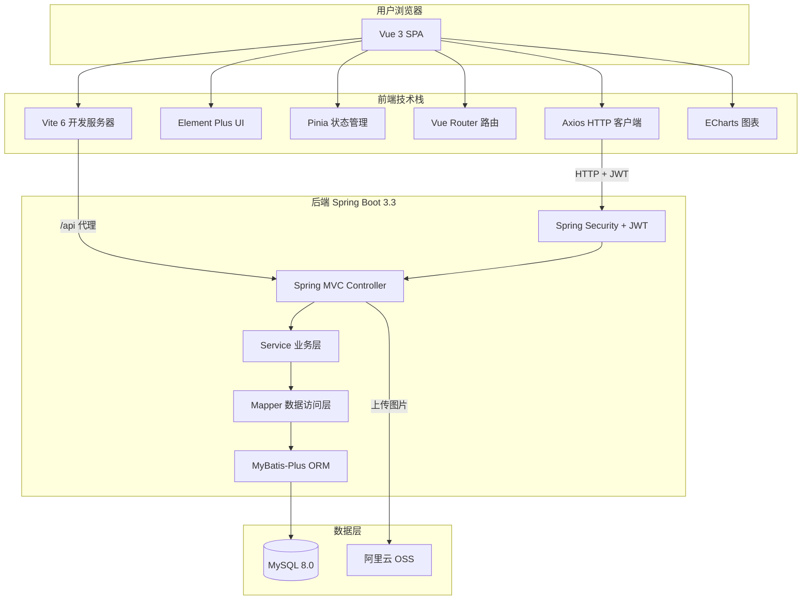

---

## 3. 后端模块依赖图

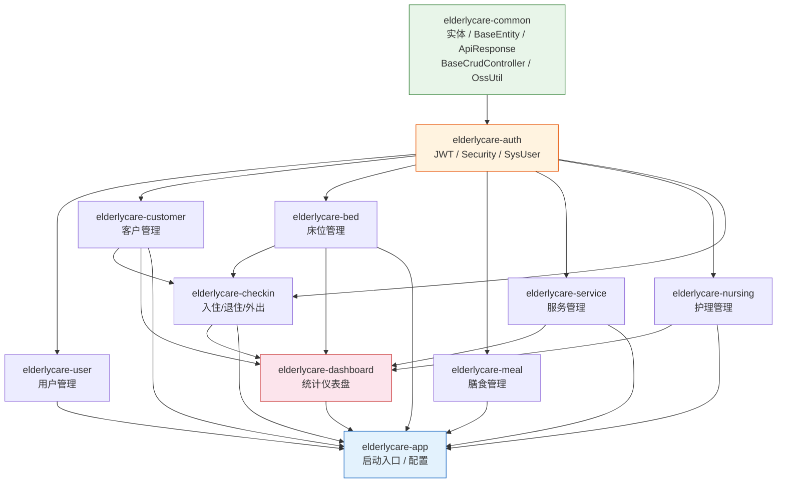

---

## 4. 前端组件关系图

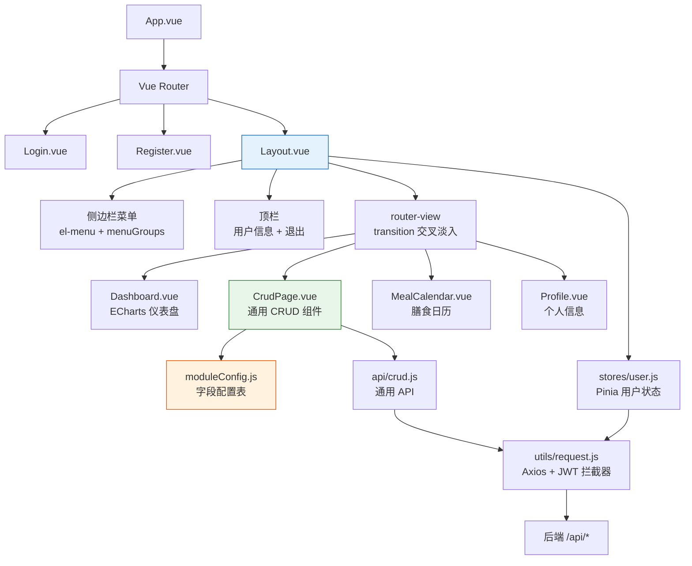

---

## 5. 登录时序图

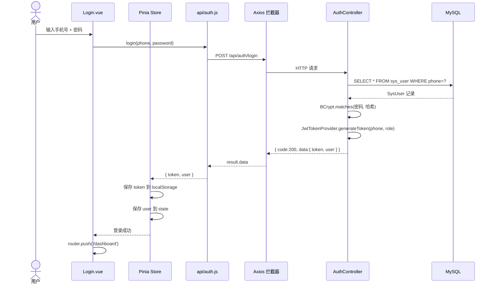

---

## 6. CRUD 操作时序图

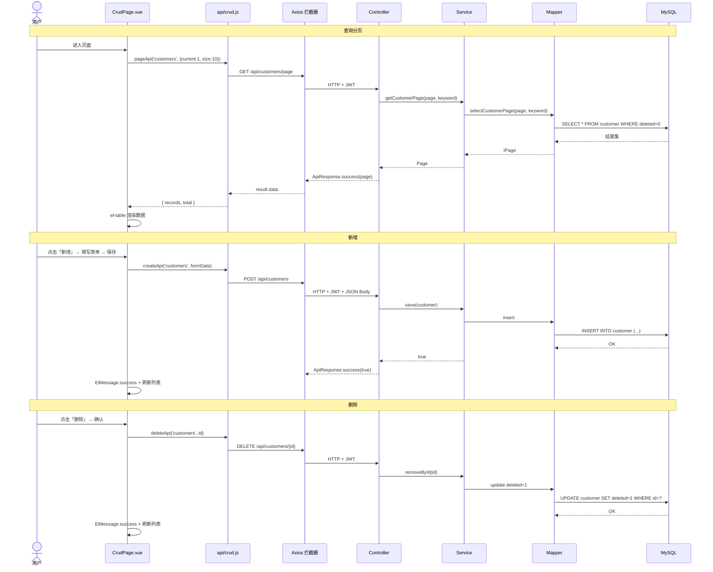

---

## 7. 入住登记时序图

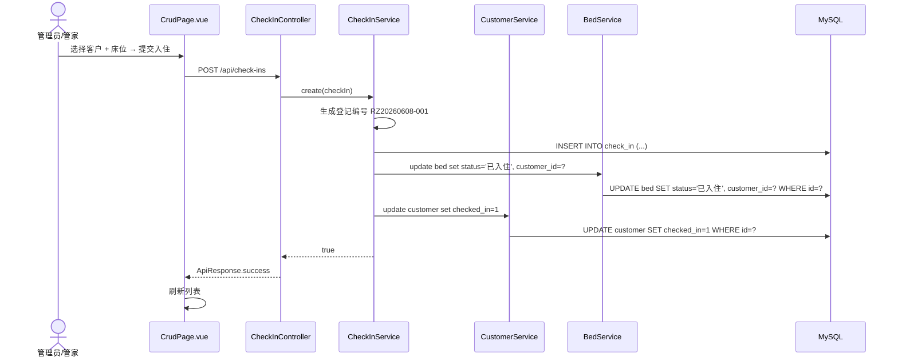

---

## 8. 退住登记时序图

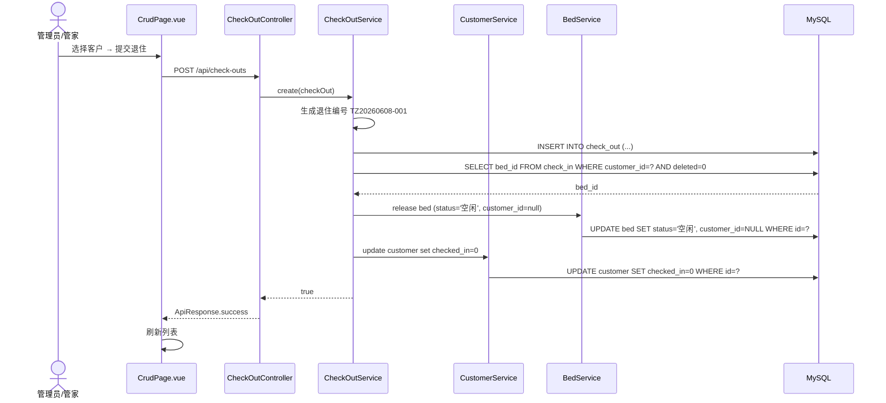

---

## 9. 入住流程图

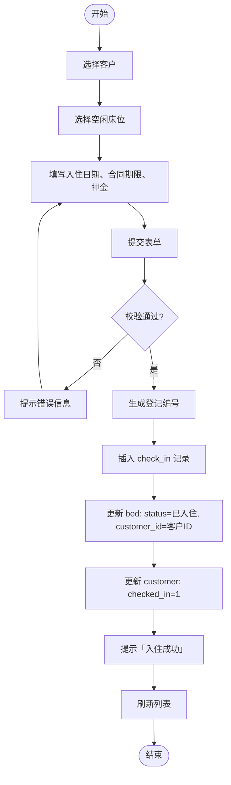

---

## 10. 退住流程图

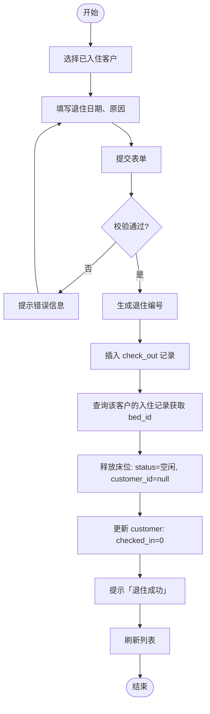

---

## 11. 外出登记流程图

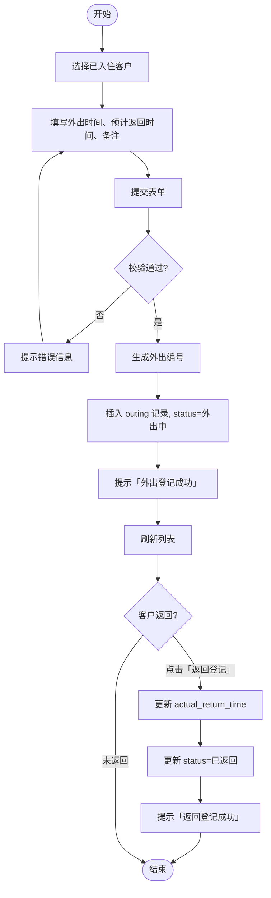

---

## 12. 前端路由守卫流程图

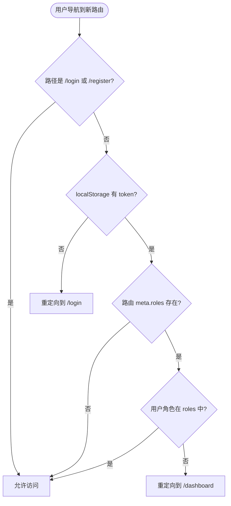

---

## 13. JWT 认证流程图

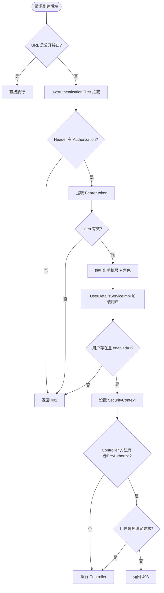

---

## 14. 文件上传流程图

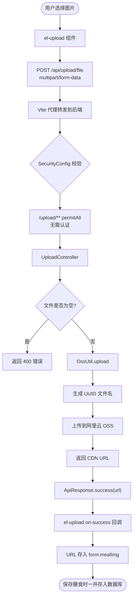

---

## 15. 前端通用 CRUD 渲染流程图

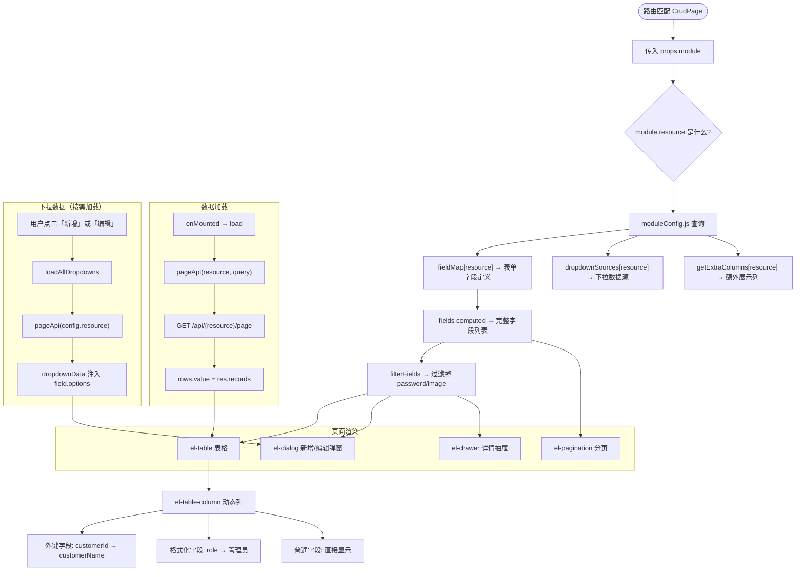

---

## 16. 角色权限矩阵图

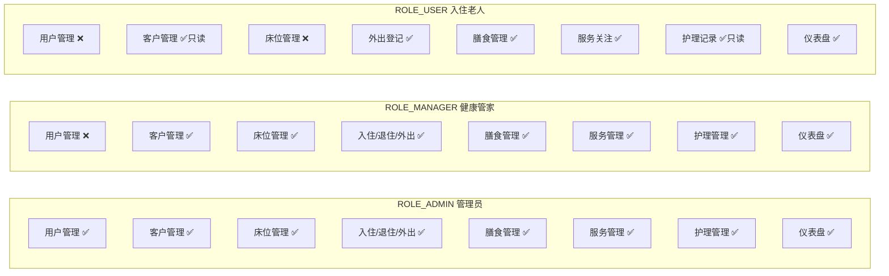

---

## 附录：Mermaid 渲染工具

| 工具 | 说明 |
|------|------|
| **VSCode** | 安装 `Markdown Preview Mermaid Support` 插件 |
| **Typora** | 原生支持 Mermaid |
| **GitHub** | `.md` 文件中的 mermaid 代码块自动渲染 |
| **在线编辑器** | [mermaid.live](https://mermaid.live) |

---
